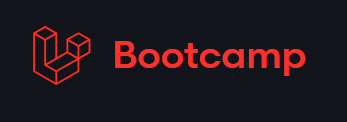
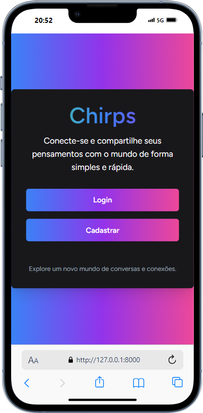
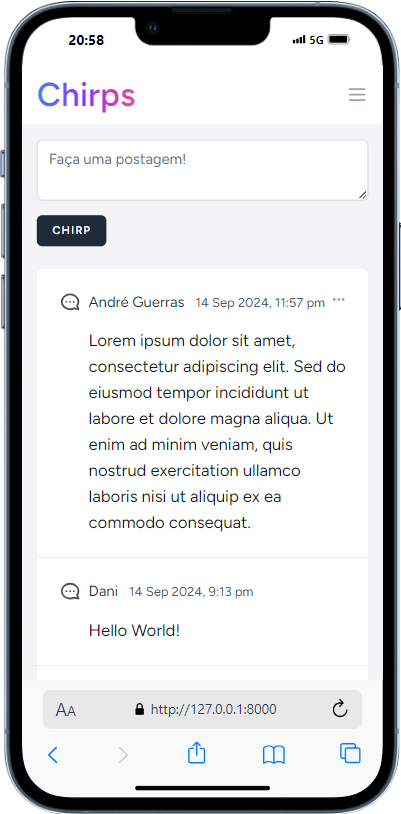
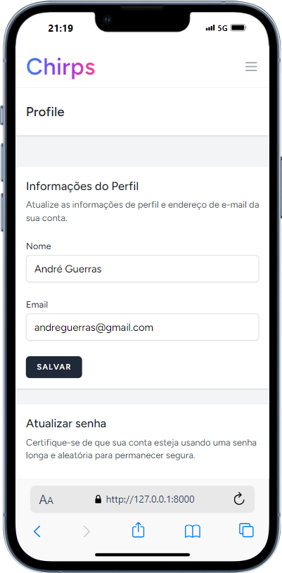

# Chirps - Laravel Bootcamp Project 

  

Chirps é uma aplicação desenvolvida durante o Laravel Bootcamp. Este projeto serve como uma plataforma para os usuários se conectarem e compartilharem seus pensamentos de forma rápida e fácil.

## Funcionalidades

- **Autenticação de Usuários**: Cadastro, Login, Lembrar-me, Recuperação de Senha.

- **Postagem de Chirps**: Crie, edite e exclua pequenas postagens chamadas "chirps".
- **Sistema de Relacionamentos**: Cada chirp é associado a um usuário.
- **Interface Dinâmica**: Implementada com Laravel Livewire para atualizações em tempo real sem a necessidade de recarregar a página.
- **Responsividade**: A interface é completamente responsiva, adaptando-se bem a diferentes dispositivos e tamanhos de tela.

## Tecnologias Utilizadas

- **Laravel**: Framework PHP para construção de aplicações web.
- **Livewire**: Framework full-stack para Laravel, permitindo a criação de interfaces dinâmicas.
- **Tailwind CSS**: Framework CSS utilitário para criar layouts modernos e responsivos.
- **Alpine.js**: Uma estrutura minimalista para adicionar comportamento JavaScript a seus projetos Laravel.

## Requisitos

- **PHP 8.3** ou superior
- **Composer** (para gerenciar dependências)
- **Node.js e NPM** (para gerenciar pacotes de frontend)
- **Banco de dados MariaDB/MySQL** (ou qualquer banco de dados compatível com Laravel)